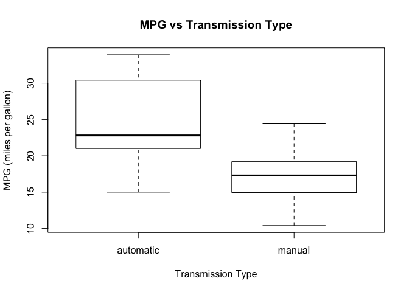
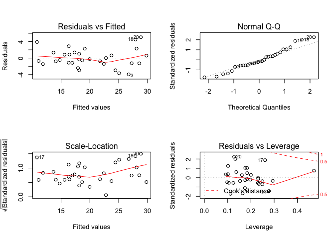

# Regression Models Project: Motor Trend MPG Analysis
Telvis Calhoun  
February 26, 2016  

## Executive Summary

We explore the `Motor Trend Car Road Tests` (mtcars) dataset. We'll analyze this dataset to answer the following questions. 

1. “Is an automatic or manual transmission better for MPG”
2. "Quantify the MPG difference between automatic and manual transmissions"

To accomplish this, we will first determine the relationship between the covariates in the `mtcars` data. Next, we build several linear regression models and use model selection techniques to find the "best fit" model. Finally, we perform statistical inference using the "best fit"" model to determine the relationship between MPG and the transmission type after adjusting for statistically significant covariates.

We conclude that both "automatic" and "manual" transmissions have roughly equal MPG after we adjust for for Number of Cylinders, Gross Horsepower and weight. The analysis shows that MPG for a manual transmission decreases by `1.8 mpg` holding other variables constant.

## Exploratory Analysis

First, lets load libraries and datasets used in the analysis.


```r
library(datasets)
library(ggplot2)
library(dplyr)
data("mtcars")
```

**Appendix 1** shows the `mtcars` dataset has 11 variables. Let's change the `am` variable to a factor. This will make the `R` output show the strings 'automatic' where `am == 1` and 'manual' where `am == 0`. We also make `cyl` a factor since its values are only `4` and `6`.


```r
mtcars <- mutate(mtcars, 
                 am=factor(ifelse(am==1, 'automatic', 'manual')),
                 cyl=as.factor(cyl))
table(mtcars$am)
```

```
## 
## automatic    manual 
##        13        19
```

The boxplot below shows the group mean is `24.4 mpg` for 'automatic' transmissions and `17.14 mpg` for 'manual' transmissions. The difference in the group means seem significant. However, we will show that the difference is less significant after we adjust for other variables.

 


## Model Selection

Before we can characterize the relationship between `mpg` and the transmission type (`am`), we must first search for other variables that can distort, or confound the relationship between the `mpg` and `am`. The analysis performed in **Appendix 2** shows that `cyl`, `disp`, `hp`, `drat`, `wt` all significantly change the `am` coeffient when included in a linear model with `am`. In **Appendix 3**, we generate nested models for `am` plus these `5` variables then evaluate them using nested likelihood ratio tests.

The "best fit" model includes: `am`, `cyl`, `hp` and `wt`.


```r
best_fit <- lm(mpg ~ am + cyl + hp + wt, data=mtcars)
```

The `r.squared` value for this model indicates that `83%` of the total variablity is explained by the linear relationship between the outcome `mpg` and the predictors `am`, `cyl`, `hp` and `wt`.


```r
summary(best_fit)$adj.r.squared
```

```
## [1] 0.8400875
```

Finally, in **Appendix 4** we plot the residuals to search for a pattern in the versus the fitted (`yhat`) values. The plot shows a slight curve in the values - but nothing too bad.

## Automatic Vs. Manual Comparison

Now that we have a model containing the necessary covariates, let's calculate the change in `mpg` for transmission type after adjusting for Number of Cylinders (`cyl`), Gross Horsepower (`hp`) and weight (`wt`). The results show that the `mpg` for a manual transmission decreases by `1.80 mpg` holding other variables constant.


```r
summary(best_fit)$coef
```

```
##                Estimate Std. Error   t value     Pr(>|t|)
## (Intercept) 35.51753528 2.03171034 17.481594 6.811749e-16
## ammanual    -1.80921138 1.39630450 -1.295714 2.064597e-01
## cyl6        -3.03134449 1.40728351 -2.154040 4.068272e-02
## cyl8        -2.16367532 2.28425172 -0.947214 3.522509e-01
## hp          -0.03210943 0.01369257 -2.345025 2.693461e-02
## wt          -2.49682942 0.88558779 -2.819404 9.081408e-03
```

However, the confidence interval for `am` ranges from `-4.6` to `1.06`. Because it includes 0, we cannot reject the null hypothesis after  adjusting for Number of Cylinders (`cyl`), Gross Horsepower (`hp`) and weight (`wt`). Therefore, we conclude that both "automatic" and "manual" transmissions have roughly equal MPG after we adjust for `cyl`, `hp` and `wt`.


```r
confint(best_fit)
```

```
##                   2.5 %       97.5 %
## (Intercept) 31.34129487 39.693775694
## ammanual    -4.67935639  1.060933628
## cyl6        -5.92405718 -0.138631806
## cyl8        -6.85902199  2.531671342
## hp          -0.06025492 -0.003963941
## wt          -4.31718120 -0.676477640
```


## Conclusion
We conclude that both "automatic" and "manual" transmissions have roughly equal MPG after we adjust for for Number of Cylinders (`cyl`), Gross Horsepower (`hp`) and weight (`wt`). The analysis shows that the `mpg` for a manual transmission decreases by `1.8 mpg` holding other variables constant. 

# Appendix
##  Appendix 1: mtcars summary


```r
summary(mtcars)
```

```
##       mpg        cyl         disp             hp             drat      
##  Min.   :10.40   4:11   Min.   : 71.1   Min.   : 52.0   Min.   :2.760  
##  1st Qu.:15.43   6: 7   1st Qu.:120.8   1st Qu.: 96.5   1st Qu.:3.080  
##  Median :19.20   8:14   Median :196.3   Median :123.0   Median :3.695  
##  Mean   :20.09          Mean   :230.7   Mean   :146.7   Mean   :3.597  
##  3rd Qu.:22.80          3rd Qu.:326.0   3rd Qu.:180.0   3rd Qu.:3.920  
##  Max.   :33.90          Max.   :472.0   Max.   :335.0   Max.   :4.930  
##        wt             qsec             vs                 am    
##  Min.   :1.513   Min.   :14.50   Min.   :0.0000   automatic:13  
##  1st Qu.:2.581   1st Qu.:16.89   1st Qu.:0.0000   manual   :19  
##  Median :3.325   Median :17.71   Median :0.0000                 
##  Mean   :3.217   Mean   :17.85   Mean   :0.4375                 
##  3rd Qu.:3.610   3rd Qu.:18.90   3rd Qu.:1.0000                 
##  Max.   :5.424   Max.   :22.90   Max.   :1.0000                 
##       gear            carb      
##  Min.   :3.000   Min.   :1.000  
##  1st Qu.:3.000   1st Qu.:2.000  
##  Median :4.000   Median :2.000  
##  Mean   :3.688   Mean   :2.812  
##  3rd Qu.:4.000   3rd Qu.:4.000  
##  Max.   :5.000   Max.   :8.000
```

## Appendix 2: covariate selection

Let's "get our hands dirty" and quantify the percentage change in the `am` coefficient when we adjust for all other variables. The output shows that `cyl`, `disp`, `hp`, `drat`, `wt` all change the `am` coeffient by greater than +/- 25%


```r
# baseline
a <- summary(lm(mpg ~ am, data=mtcars))$coef[2]

# calc percent change in the baseline for each covariate
rbind(
  c('baseline', 'cyl', 'disp', 'hp', 'drat', 'wt', 'qsec', 'vs', 'gear', 'carb'),
  round(c((a-a)/a,
    100 * (a - summary(lm(mpg ~ am + cyl, data=mtcars))$coef[2])/a,
    100 * (a - summary(lm(mpg ~ am + disp, data=mtcars))$coef[2])/a,
    100 * (a - summary(lm(mpg ~ am + hp, data=mtcars))$coef[2])/a,
    100 * (a - summary(lm(mpg ~ am + drat, data=mtcars))$coef[2])/a,
    100 * (a - summary(lm(mpg ~ am + wt, data=mtcars))$coef[2])/a,
    100 * (a - summary(lm(mpg ~ am + qsec, data=mtcars))$coef[2])/a,
    100 * (a - summary(lm(mpg ~ am + vs, data=mtcars))$coef[2])/a,
    100 * (a - summary(lm(mpg ~ am + gear, data=mtcars))$coef[2])/a,
    100 * (a - summary(lm(mpg ~ am + carb, data=mtcars))$coef[2])/a
  ), digits=2)
)
```

```
##      [,1]       [,2]    [,3]    [,4]    [,5]    [,6]     [,7]     [,8]   
## [1,] "baseline" "cyl"   "disp"  "hp"    "drat"  "wt"     "qsec"   "vs"   
## [2,] "0"        "64.67" "74.69" "27.16" "61.25" "100.33" "-22.52" "16.26"
##      [,9]   [,10]  
## [1,] "gear" "carb" 
## [2,] "1.43" "-5.63"
```

## Appendix 3: model selection

We generate nested models for these `5` variables using and evaluate them using a nested likelihood ratio tests. The results show that models 2, 4 and 6 have the greatest significance. This suggests that `disp` and `drat` should be excluded from the model.


```r
fit1 <- lm(mpg ~ am, data=mtcars)
fit2 <- lm(mpg ~ am + cyl, data=mtcars)
fit3 <- lm(mpg ~ am + cyl + disp, data=mtcars)
fit4 <- lm(mpg ~ am + cyl + disp + hp, data=mtcars)
fit5 <- lm(mpg ~ am + cyl + disp + hp + drat, data=mtcars)
fit6 <- lm(mpg ~ am + cyl + disp + hp + drat + wt, data=mtcars)
anova(fit1, fit2, fit3, fit4, fit5, fit6)
```

```
## Analysis of Variance Table
## 
## Model 1: mpg ~ am
## Model 2: mpg ~ am + cyl
## Model 3: mpg ~ am + cyl + disp
## Model 4: mpg ~ am + cyl + disp + hp
## Model 5: mpg ~ am + cyl + disp + hp + drat
## Model 6: mpg ~ am + cyl + disp + hp + drat + wt
##   Res.Df    RSS Df Sum of Sq       F   Pr(>F)    
## 1     30 720.90                                  
## 2     28 264.50  2    456.40 36.4876 5.28e-08 ***
## 3     27 230.46  1     34.04  5.4421  0.02837 *  
## 4     26 183.04  1     47.42  7.5822  0.01106 *  
## 5     25 182.38  1      0.66  0.1052  0.74847    
## 6     24 150.10  1     32.28  5.1614  0.03234 *  
## ---
## Signif. codes:  0 '***' 0.001 '**' 0.01 '*' 0.05 '.' 0.1 ' ' 1
```

The comparison below shows that a model with the variables: `am`, `cyl`, `hp` and `wt` is a better fit than a model containing only `am`. This is our "best fit" model.


```r
fit1 <- lm(mpg ~ am, data=mtcars)
fit7 <-   lm(mpg ~ am + factor(cyl) + hp + wt, data=mtcars)
anova(fit1, fit7)
```

```
## Analysis of Variance Table
## 
## Model 1: mpg ~ am
## Model 2: mpg ~ am + factor(cyl) + hp + wt
##   Res.Df    RSS Df Sum of Sq      F    Pr(>F)    
## 1     30 720.90                                  
## 2     26 151.03  4    569.87 24.527 1.688e-08 ***
## ---
## Signif. codes:  0 '***' 0.001 '**' 0.01 '*' 0.05 '.' 0.1 ' ' 1
```

## Appendix 4: residual plot for final model
Finally, we plot the residuals (top left) to search for a pattern in the residuals vs the fitted (yhat) values.

 

